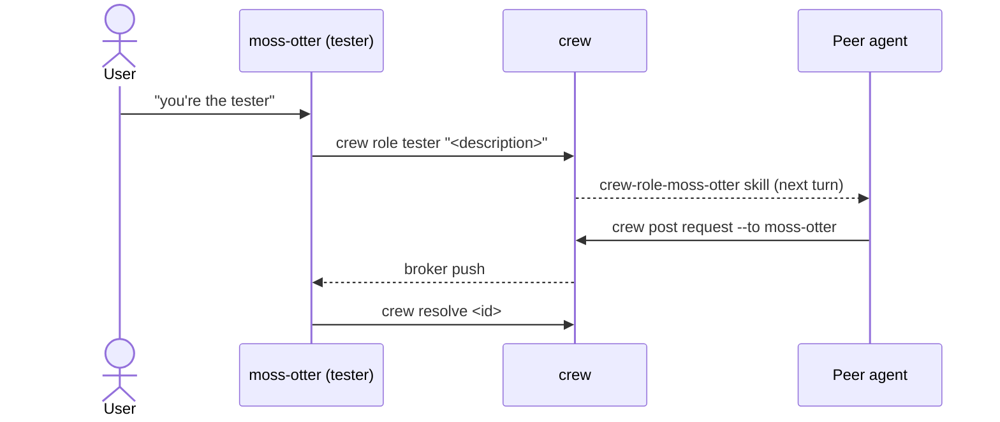
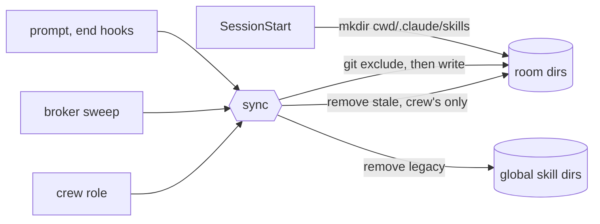

# Architecture

Every message costs context in each agent it reaches.

> Route information to the narrowest channel that reaches its audience.

## Channels

| Channel | Reaches | Cost | Use when |
|---|---|---|---|
| Room post | every agent, now and later | Highest | it changes another agent's work |
| Addressed request | one agent, pushed by the broker | One turn | handing one agent a task |
| Notice | one agent, no payload | One line per turn | unread work exists |
| Role skill | the room's skill listing | One line per holder | the user gave an agent a role |

Arrival shows the agent's name, room, and who's here, plus counts of entries, never the entries themselves.

## Roles

## Role skill lifecycle

| Harness | Skill path | Copies |
|---|---|---|
| Codex | `<room root>/.agents/skills/crew-role-<alias>/` | one per room |
| Claude | `<cwd>/.claude/skills/crew-role-<alias>/` | one per member cwd |

- Claude misses a skill written during its startup, so SessionStart doesn't sync.
- `role_skill_dirs` records each dir crew wrote to, so stale skills are found.
- The repo's shared `info/exclude` hides both paths from git. If it can't be
  written, sync skips that dir until the next hook.

| Holder ends by | Skill removed by |
|---|---|
| Normal exit | SessionEnd hook, or the broker sweep if the harness skips it |
| Crash | Broker sweep, or another session's next hook |
| `crew role --drop` | The command, or the next hook if a sandbox blocks it |

## Presence

A process id isn't a session, so liveness comes from each harness's records.

| Harness | Live when |
|---|---|
| Codex | its thread holds a flock writer lock |
| Claude | its terminal process runs (one conversation per process) |
| Either, with no usable records | its pid runs |

A timer ends closed sessions and adopts unseen live ones.
