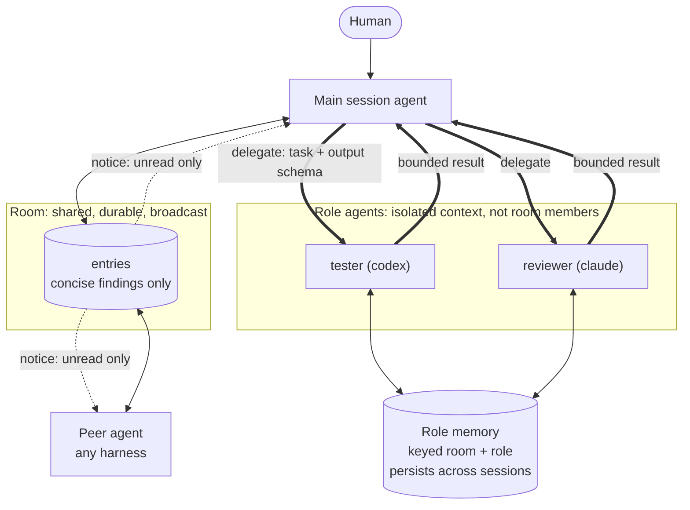
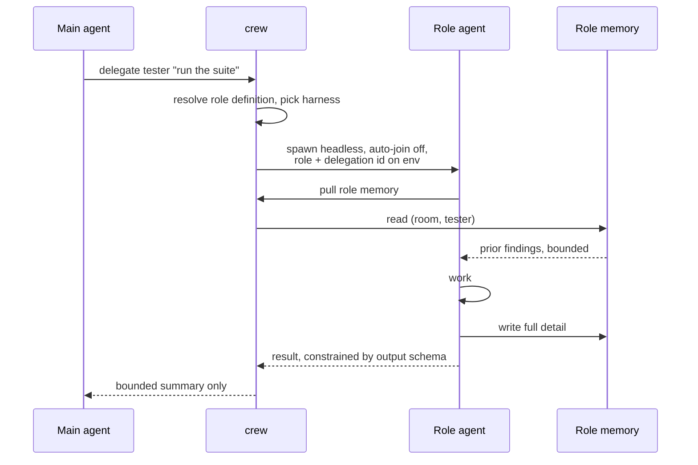

# Architecture

Crew's organizing constraint is agent context, not storage. Every channel below
costs some agent's context window. The cost scales with how many agents a
message reaches, so the bar for using a channel scales the same way.

> Route information to the narrowest channel that reaches its actual audience.

## Channels

| Channel | Audience | Context cost | Bar for writing |
|---|---|---|---|
| Room post | every participant, now and later | Highest | Changes another agent's work |
| Delegation result | one launcher | Medium, schema-bounded | The answer, nothing else |
| Ask/answer | one requester, blocking | Low, one question | Context only the requester has |
| Role memory | one role, pulled on demand | Lowest | Anything useful to that role next time |
| Notice | one agent, no payload | Near zero | Unread work exists |

The room is the most expensive channel in the system: a post is durable and
reaches every agent that works here afterward. It is for cross-agent knowledge,
not for recording work.

Arrival is deliberately cheap. A session start injects the room's name, who else
is here, and a count of what it holds, never the entries and never an
acknowledgement. They stay unread so the turn notice can offer them: a backlog
costs one line per turn until someone reads it, not a screen on every arrival.

## Shape

Role agents are deliberately outside the room. They are spawned with auto-join
disabled, so they never join it and never post into it.

That isolation covers writes only. Reads are not gated: a non-member's
accessible-room list is empty, and the entry and search queries read an empty
room filter as no filter rather than no results, so a spawned role running
`crew room` sees every room. A gap to close in those queries, not a property to
rely on.

## Presence

Who is here decides the roster, room membership, and who a request can be
addressed to.

A process id is not a session identity. One harness process hosts many
conversations: a Claude process spans every session `/clear` creates, a Codex
process holds its user thread alongside its subagent and review threads, and an
app-server daemon outlives all of them. Judging a session by its pid keeps dead
conversations active forever and misses live ones.

So liveness comes from each harness's own records. Codex publishes a flock-held
writer lock per open thread, and the thread's rollout says whether a person
drives it or whether it is an internal subagent. Claude keeps no equivalent but
is one conversation per terminal process, so the pid check is right there. A
harness reporting nothing usable falls back to the pid check rather than having
its sessions reaped.

The registry reconciles both ways on a timer: a session whose conversation is
closed ends, a live one it never saw is adopted. Last-seen comes from the
conversation file, since the prompt hook only fires on a user turn.

## Routing

Routing decides what work leaves the main session. It is the component that
turns context management from a convention into a mechanism, so it is worth
treating as a first-class subsystem rather than a hook detail.

Four decisions, in order:

1. Delegate at all, or do the work inline
2. Which role
3. Which harness, where the role allows more than one
4. Wait for the result, or queue the work

At SessionStart, crew injects the room's active delegation agents, their
descriptions, and the command that spawns one. The notice tells the main agent
to protect its context by delegating bounded investigation and testing early.
The main agent sees the full user request and makes the semantic decision;
crew does not classify prompt text or intercept tool calls.

### Configuration

Roles are data, never hook logic. Adding a role is adding a file, and activating
it adds that role to the room's next SessionStart roster.

## Delegation

The launcher initiates, crew spawns. A launcher issues a tool call and crew forks
a headless harness process, because a harness's own sub-agent machinery can only
spawn its own kind and cross-harness delegation is the point. Isolation comes
from the process boundary rather than from who created it: the child's reasoning
and tool calls never reach the launcher, only the bounded result does.

Three destinations, by lifetime and audience:

- Full detail goes to role memory. Private to the role, survives the session.
- The summary goes to the launcher. Schema-constrained, so bloat is bounded by
  construction rather than by the role agent's good behavior.
- The room gets nothing by default. A result is promoted to a post only when it
  is genuinely useful to other agents.

Both harnesses can enforce the output schema: Claude with --json-schema, Codex
with --output-schema. Use it. An instruction to "be concise" is not a bound.

### Asking back

A delegated role gets a task and no context. `crew ask "<question>"` posts a
request addressed to its requester and blocks until `crew answer <id> "<body>"`
writes one, bounded by a wait that fits inside the spawn timeout. Unanswered,
the role reports what it could not determine rather than guessing.

Requests live in their own table, addressed and readable only through the
recipient's inbox; the room stays broadcast-only. Delivery is asymmetric by
necessity: the requester is a live session the broker can wake, while nothing
can wake a headless spawn, so the role polls. A finished delegation closes
whatever its role left open.

## Memory

Keyed by room and role, never by session, so a role's knowledge survives the
processes that produced it. Kept out of entries and out of generated room
snapshots, so it cannot leak into anyone else's briefing.

A fresh spawn plus a bounded memory pull is preferable to resuming a prior
session. Resume carries unbounded history; memory does not.

Where a room defines no roles, memory falls back to session scope. The policy is
a key derivation, not a separate code path.

## Why not one channel

A single shared timeline fails in both directions. Inbound, a task-scoped agent
receives unrelated chatter it has to read past. Outbound, routine results land
in every participant's context forever.

Private traffic is kept in separate tables rather than behind a visibility flag
on entries. A flag has to be filtered correctly by every read path, including
generated snapshots, and one missed filter leaks. A separate table cannot leak
by omission.
