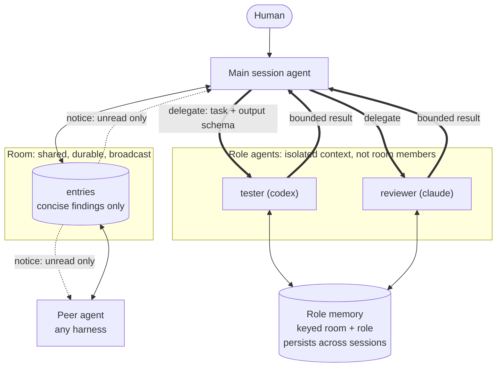
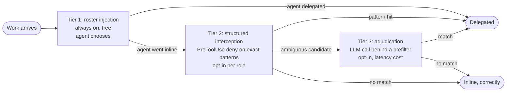
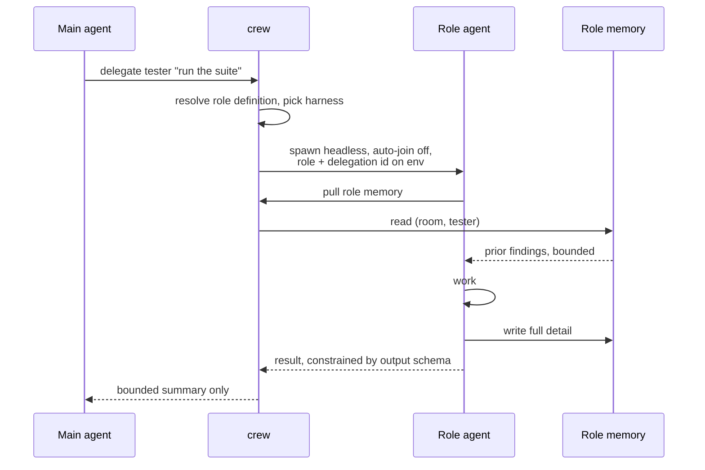

# Context management

Crew's organizing constraint is agent context, not storage. Every channel below
costs some agent's context window. The cost scales with how many agents a
message reaches, so the bar for using a channel scales the same way.

> Route information to the narrowest channel that reaches its actual audience.

## Channels

| Channel | Audience | Context cost | Bar for writing |
|---|---|---|---|
| Room post | every participant, now and later | Highest | Changes another agent's work |
| Delegation result | one launcher | Medium, schema-bounded | The answer, nothing else |
| Role memory | one role, pulled on demand | Lowest | Anything useful to that role next time |
| Notice | one agent, no payload | Near zero | Unread work exists |

The room is the most expensive channel in the system: a post enters the
briefing of every agent that joins afterward, forever. It is for cross-agent
knowledge, not for recording work.

## Shape

Role agents are deliberately outside the room. They are spawned with auto-join
disabled, so they never receive the room briefing and never post into it. Room
membership enforcement already denies their reads and writes, so the isolation
needs no new guard.

## Routing

Routing decides what work leaves the main session. It is the component that
turns context management from a convention into a mechanism, so it is worth
treating as a first-class subsystem rather than a hook detail.

Four decisions, in order:

1. Delegate at all, or do the work inline
2. Which role
3. Which harness, where the role allows more than one
4. Sync, blocking the launcher, or async into the room

### Signal quality

Routing accuracy is bounded by the signal available at each point.

| Point | Signal | Reliability |
|---|---|---|
| UserPromptSubmit | Prose intent | Low, paraphrase defeats patterns |
| PreToolUse | Structured tool input | High, exact match on commands and paths |
| SessionStart | Identity only, no task | N/A, carries roster and role memory |

Match on structured input wherever it exists. Classifying prose
deterministically is where this design fails.

### Tiers

Tier 1 injects the room's active roles and lets the agent match. It costs
nothing, needs no patterns, and reinforces the harnesses' own description-based
delegation rather than fighting it. It is advisory, so it is sometimes ignored.

Tier 2 catches exactly that case: the agent decided to run the full suite
inline, and the tool call is an exact match. Deny with a reason is supported
identically on both harnesses. It needs a carve-out so targeted work passes
through, since blocking every invocation of a command is worse than not routing
at all.

Tier 3 is the escape hatch for prose that matters. Gate it behind a cheap
deterministic prefilter so latency is paid only on candidates, or run it async
and surface the suggestion on the next notice. The router can shell out to
whichever harness binary is already installed, so it needs no separate key.

### Configuration

Routing rules are data carried in role definitions, never logic in hooks. Adding
a role is adding a file, which is where the dynamism comes from. A hook stays a
generic matcher over the active roster.

Every routing decision and whether the agent took it should be recorded from the
start. It is the only way to tell a useful rule from an annoying one, and it is
the dataset a learned router would need later.

## Delegation

The launcher initiates, crew spawns. A launcher issues a tool call and crew forks
a headless harness process, because a harness's own sub-agent machinery can only
spawn its own kind and cross-harness delegation is the point. Isolation comes
from the process boundary rather than from who created it: the child's reasoning
and tool calls never reach the launcher, only the bounded result does.

Three destinations, by lifetime and audience:

- Full detail goes to role memory. Private to the role, survives the session.
- The summary goes to the launcher. Schema-constrained, so bloat is bounded by
  construction rather than by the role agent's good behavior.
- The room gets nothing by default. A result is promoted to a post only when it
  is genuinely useful to other agents.

Both harnesses can enforce the output schema: Claude with --json-schema, Codex
with --output-schema. Use it. An instruction to "be concise" is not a bound.

## Memory

Keyed by room and role, never by session, so a role's knowledge survives the
processes that produced it. Kept out of entries and out of generated room
snapshots, so it cannot leak into anyone else's briefing.

A fresh spawn plus a bounded memory pull is preferable to resuming a prior
session. Resume carries unbounded history; memory does not.

Where a room defines no roles, memory falls back to session scope. The policy is
a key derivation, not a separate code path.

## Why not one channel

A single shared timeline fails in both directions. Inbound, a task-scoped agent
receives unrelated chatter it has to read past. Outbound, routine results land
in every participant's context forever.

Private traffic is kept in separate tables rather than behind a visibility flag
on entries. A flag has to be filtered correctly by every read path, including
generated snapshots, and one missed filter leaks. A separate table cannot leak
by omission.
